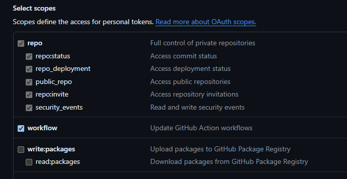
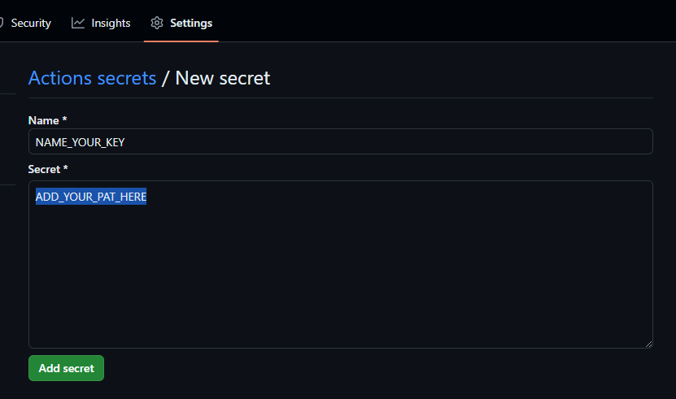

# workflow-sandbox

Sandbox environment for learning how to use github actions.

## The Reality

Actions executed from a workflow will not trigger other workflows.
So if a workflow creates a PR or makes a new commit, it won't trigger workflows that are listening to those events.

## The Issue

If you have branch protection rules set up so that certain checks NEED to be
run before code can be merged, those checks won't run if a new PR or a new code commit was made by another workflow. Those checks will forever be in a pending state, never to be run.

## Workarounds

Github is already aware of this issue and confirm that this is expected
behavior. Basically every action during a workflow, behind the scenes,
uses a token called `GITHUB_TOKEN`. Actions taken by workflows using this
token will not trigger other workflows to run.

Here are possible workarounds for this issue:

1. ~~Add functionality to run the workflows manually / set workflows that call other workflows~~ **(DOES NOT WORK)**
2. Disable branch protection rules / required checks
3. Use a Personal Access Token (PAT) **(RECOMMENDED BY GITHUB)**
4. Create a Github App with the necessary permissions

## How to Use a Personal Access Token (PAT)

1. If you are the repository owner, set up a PAT for your account

   - `GitHub Account Settings` -> `Developer Settings` -> `Personal Access Tokens`
     -> `Tokens (Classic)` -> `Generate new token` -> `Generate new token (classic)`
   - Set permissions / Scopes (Must be "workflow" or greater)  
     
   - Click on 'Generate token' and save the generated token for later use

    

2. Add the PAT as a Repository Secret

   - `Repository Settings` -> `Secrets and variables` -> `Actions`
     -> `Repository secrets` -> `New repository secret`
   - Add your PAT  
     

     

3. Reference PAT in workflow .YML file
   - Use the `secrets` global variable / github actions context to
     reference your PAT.
   - Example (line 60): [actions.yml](./.github/workflows/actions.yml)

That's it.

<u>**IMPORTANT NOTE**</u> 

- When making your own workflow, this can potentially lead to scheduling workflows
  recursively, use this with caution.
- Demo Pull Request with a workflow that commits code: [Pull Request](https://github.com/gokris165/workflow-sandbox/pull/7)

## Additional Reading Material

- [[DISCUSSION] Github action not triggered when github-actions bot makes pull request](https://github.com/orgs/community/discussions/55906)
- [[DISCUSSION] GitHub-actions bot not triggering Actions](https://github.com/orgs/community/discussions/33804)
- [[DISCUSSION] Push from Action does not trigger subsequent action](https://github.com/orgs/community/discussions/25702)
- [[GH DOCS] Regarding Tokens, Permissions, and Workflows](https://docs.github.com/en/actions/security-guides/automatic-token-authentication#granting-additional-permissions)
- [[GH DOCS] Creating Personal Access Tokens](https://docs.github.com/en/authentication/keeping-your-account-and-data-secure/managing-your-personal-access-tokens#creating-a-personal-access-token-classic)
